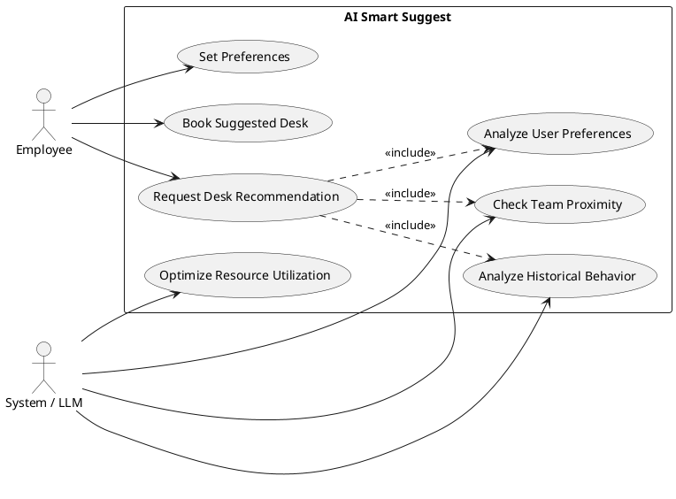
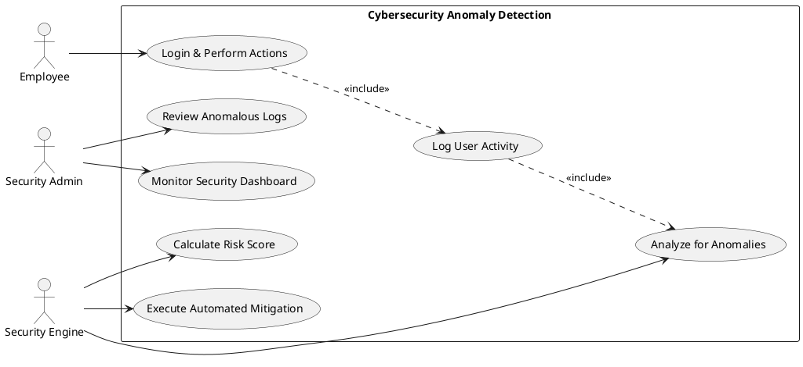
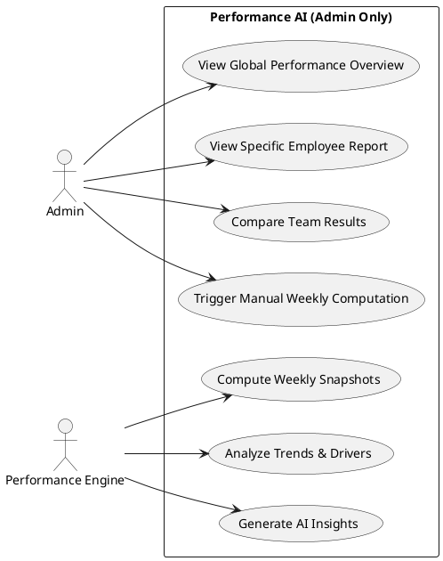

# Use Case Diagrams for AI Features

This document provides visual representations of the use cases for the three core AI engines of the Smart Office Reservation System.

## 1. ✨ AI Smart Suggest
*Intelligent workspace recommendation engine.*

### Mermaid Version
```mermaid
useCaseDiagram
    actor Employee
    actor "System / LLM" as Sys

    Employee --> (Request Desk Recommendation)
    Employee --> (Set Preferences: Floor, Zone, Equipment)
    Employee --> (Book Suggested Desk)
    
    (Request Desk Recommendation) ..> (Analyze User Preferences) : include
    (Request Desk Recommendation) ..> (Check Team Proximity) : include
    (Request Desk Recommendation) ..> (Analyze Historical Behavior) : include
    
    Sys --> (Analyze User Preferences)
    Sys --> (Check Team Proximity)
    Sys --> (Analyze Historical Behavior)
    Sys --> (Optimize Resource Utilization)
```

### PlantUML Version


---

## 2. 🛡️ Cybersecurity Anomaly Detection
*Real-time AI security engine for threat detection.*

### Mermaid Version
```mermaid
useCaseDiagram
    actor Employee
    actor "Security Engine" as Engine
    actor "Admin / SOC" as Admin

    Employee --> (Login & Perform Actions)
    
    (Login & Perform Actions) ..> (Log User Activity) : include
    (Log User Activity) ..> (Analyze for Anomalies) : include
    
    Engine --> (Analyze for Anomalies)
    Engine --> (Calculate Risk Score)
    Engine --> (Execute Automated Mitigation)
    
    (Analyze for Anomalies) <|-- (Detect Location Jump)
    (Analyze for Anomalies) <|-- (Detect Bot Traffic)
    (Analyze for Anomalies) <|-- (Detect Booking Abuse)
    
    (Execute Automated Mitigation) ..> (Request Extra Verification) : extend
    (Execute Automated Mitigation) ..> (Block Malicious Session) : extend
    
    Admin --> (Monitor Security Dashboard)
    Admin --> (Review Anomalous Logs)
    Admin --> (Manual Risk Override)
```

### PlantUML Version


---

## 3. 📊 Performance AI
*AI-driven employee engagement and analytics.*

### Mermaid Version
```mermaid
useCaseDiagram
    actor Employee
    actor Manager
    actor Admin
    actor "Performance Engine" as Sys

    Employee --> (View Personal Score & Tier)
    Employee --> (Track Own Trajectory)
    
    Manager --> (View Team Performance Report)
    Manager --> (Identify Top Performers)
    Manager --> (Identify Employees Needing Support)
    Manager --> (Read Automated AI Insights)
    
    Admin --> (Monitor Company-wide Performance)
    Admin --> (Trigger Manual Weekly Computation)
    
    Sys --> (Compute Weekly Snapshots)
    Sys --> (Analyze Trends & Outlook)
    Sys --> (Identify Positive/Negative Drivers)
    Sys --> (Generate Natural Language Summary)
    
    (Compute Weekly Snapshots) ..> (Analyze Booking Consistency) : include
    (Compute Weekly Snapshots) ..> (Calculate Planning Score) : include
    (Compute Weekly Snapshots) ..> (Evaluate Cancellation Rate) : include
```

### PlantUML Version

